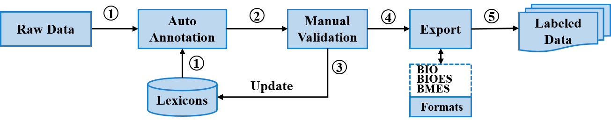
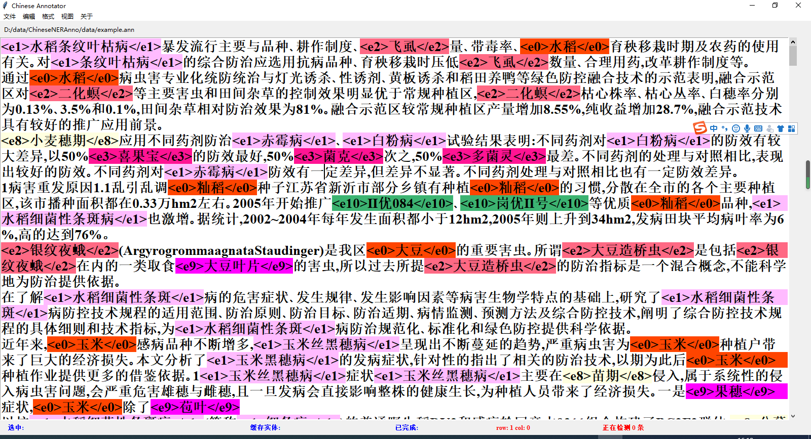
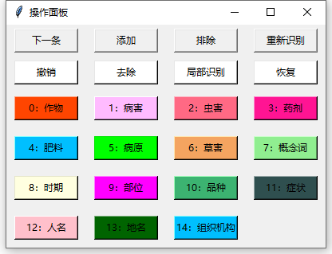
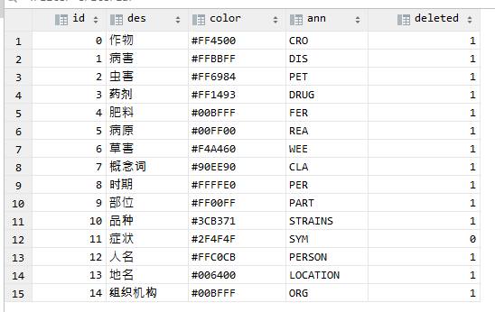

# ChineseNERAnno
Annotation tool for Chinese named entity recognition(中文命名实体标注工具,英文通用)
***

```
|-- ChineseNERAnno          #the name of this tool
    |--configs              # the configuration files for this tool
    |--data                 # the raw and annoted datas
    |--utils                # 
    |--anno_main.py         # the main file for ChineseNERAnno
```
# menu
```
|--文件
   |--打开
   |--设置
   |--保存
|--编辑
   |--控制面板
   |--检测
   |--检测长度
   |--拆分句子
   |--分割数据集
   |--转为实体
   |--转为纯文本
   |--定位
   |--查找和替换
|--格式
   |--BMES
   |--BIOES
   |--分词
```
# operation process

# main windows



# keyboard
控制面板主要用于显示预先定义的实体类别，便于实体划分。具体的实体类别可在“文件-设置”中设置，或在数据表category中设置。 \
 

# operation
* run the main file
```
python anno_main.py
```
* open the file
```
'文件-->打开'
```


* label the entity


* export the entities with BIO format

 \
* the example for the export dataset：
```
甲 B-DRUG
丙 I-DRUG
硫 I-DRUG
磷 I-DRUG
是 O
一 O
种 O
高 O
效 O
､ O
广 O
谱 O
､ O
低 O
毒 O
杀 B-CLA
虫 I-CLA
剂 I-CLA
```


# update

In the future, we will continue to add entity relationship annotation. Other functions continue to improve, please wait patiently
# reference
```
YEDDA: https://github.com/jiesutd/YEDDA.git
```
# Cited
updated later
